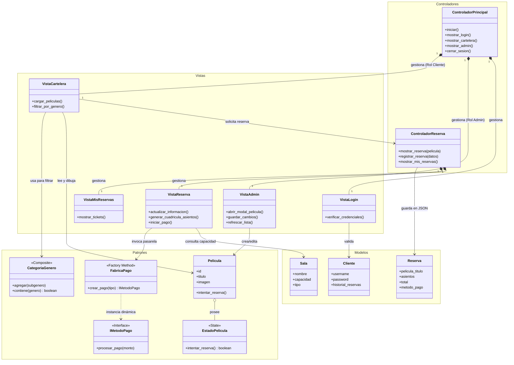

# 🎬 Sistema de Gestión y Reserva de Cine (GUI)

Este proyecto es una aplicación de escritorio con Interfaz Gráfica de Usuario (GUI) desarrollada en Python (usando la librería CustomTkinter), diseñada para simular un sistema completo de un cine. Permite tanto la gestión administrativa de películas y horarios, como la experiencia del cliente para visualizar la cartelera, elegir asientos y simular la compra de entradas.

## Características Principales

#### Inicio de Sesión (Login)
Hay un inicio de sesión que sirve tanto para el administrador como para los clientes, la diferencia es que el administrador inicia sesión con su "nombre de usuario" que es "admin", en cambio los clientes deben ingresar con un correo electrónico, sino les envía error.


### Vista de Administrador
#### Gestión de Películas:
* *CRUD Películas:* Permite crear, editar y archivar películas, asignando títulos, duración, clasificación y subida de **Pósters/Imágenes** mediante un explorador de archivos
* *Gestión de funciones:* Permite gestionar las funciones de dichas películas permitiendo asignar múltiples fechas, horas e idiomas a cada película, contando con una validación que evita que haya cruce de horarios (ej: evita que dos películas diferentes se proyecten en la misma sala y hora).


* *CRUD Salas:* Permite crear, editar y eliminar Salas, asignando a cada sala un título, la capacidad de cada sala (asientos) y el tipo de proyección (2D, 3D, IMAX, etc).


### Vista de Usuario (Cliente)
* **Cartelera Interactiva:** Presentación de películas en formato cuadrícula (Grid) separadas automáticamente por su estado (**En Cartelera** y **Próximamente**).


* **Filtros Inteligentes:** Búsqueda jerárquica de películas mediante categorías principales y subgéneros.
* **Reserva de Asientos Visual:** Cuadrícula de asientos generada dinámicamente según la capacidad real de la sala asignada (ej. Sala 1 de 50 asientos, Sala VIP de 30). Indicadores visuales para asientos libres (gris) y ocupados (rojo).


* **Pasarela de Pago:** Simulación de compra con cálculo automático de totales según cantidad de adultos y niños, seleccionando el método de pago (Tarjeta o Efectivo).
* **Historial de Reservas:** Sección "Mis Reservas" para que el usuario consulte los tickets adquiridos.

---

## Arquitectura y Patrones de Diseño

El sistema está diseñado bajo principios de Programación Orientada a Objetos (POO) y aplica tres patrones de diseño fundamentales para resolver problemas estructurales y de comportamiento:

### 1. Patrón *Factory Method* (Creacional)
Se utilizó para abstraer e instanciar los diferentes **métodos de pago**. La fábrica (`FabricaPago`) decide qué clase instanciar (`PagoTarjeta` o `PagoEfectivo`) basándose en la selección del usuario, permitiendo que en el futuro se agreguen nuevos métodos (ej. PayPal, Transferencia) sin modificar la lógica principal de la pasarela.

### 2. Patrón *Composite* (Estructural)
Implementado en el sistema de **filtros de cartelera**. Los géneros se tratan como una estructura de árbol, donde existen Categorías Principales (`CategoriaGenero`, el composite) que pueden contener tanto Subgéneros individuales (`GeneroSimple`, las hojas) como otras categorías. Esto permite que la interfaz filtre las películas tratando a subgéneros e hiper-géneros de manera uniforme.

### 3. Patrón *State* (De Comportamiento)
Utilizado para manejar el ciclo de vida de las películas en el cine. Una película cambia su comportamiento en la GUI dependiendo de si su estado interno es `EnCartelera`, `Proximamente` o `Archivada`. Por ejemplo, el estado *Próximamente* muestra un botón descriptivo, mientras que el estado *En Cartelera* habilita el botón de compra, eliminando largas sentencias condicionales (`if/else`).

---

## Diagrama UML de Clases



## Instalación y Uso
### 1. Clonar el repositorio
```python
git clone <url-de-tu-repositorio>
cd Interfaz-GUI-Cine
```

### 2. Si ya tenías el repositorio en el computador, entonces:
```python
git pull
```
Debes hacerlo dentro de la carpeta donde tengas guardado el proyecto.

### 2. Instalar las librerías necesarias
```python
pip install customtkinter Pillow
```
### 3. Ejecutar el código
```python
python main.py
```
### 4. Credenciales de prueba
* *Administrador*: Usuario: admin / Contraseña: admin123
* *Usuario Cliente*: Puedes registrar uno nuevo en la pantalla de Login o usar alguno ya guardado en clientes.json.
